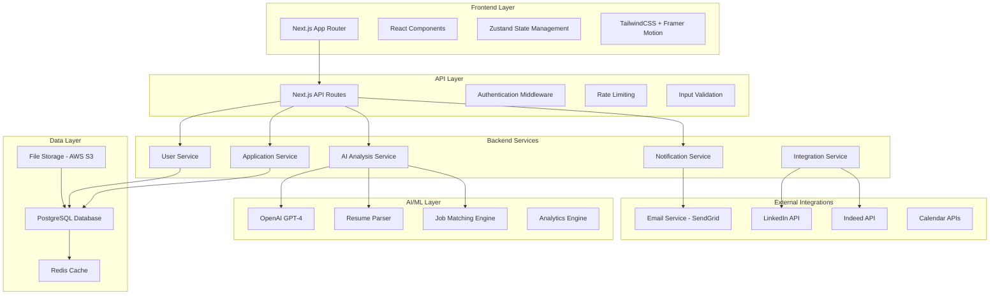
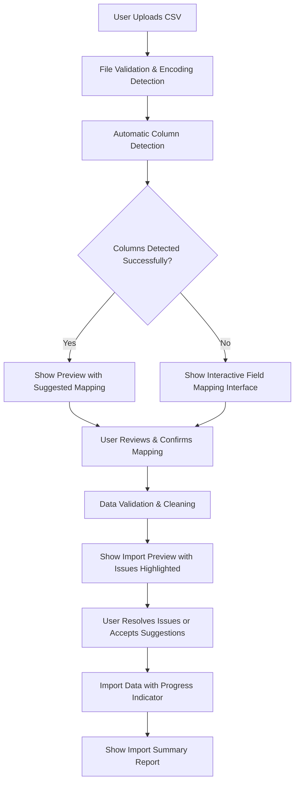
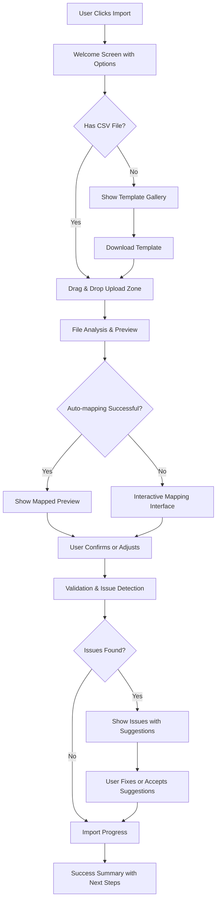
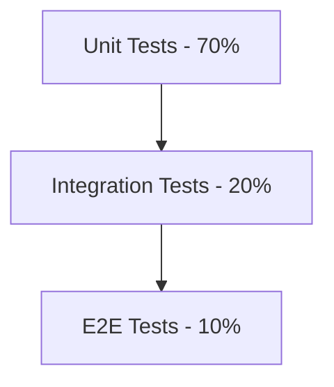
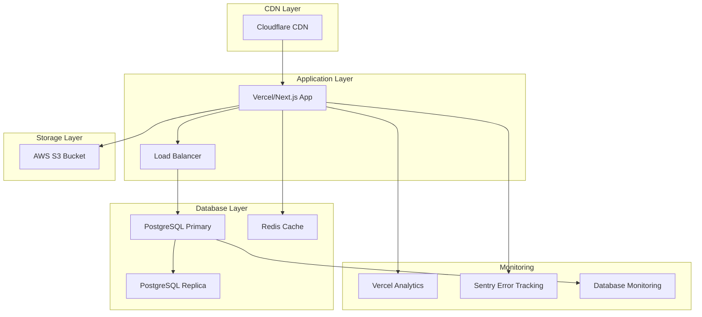

# AI Application Tracker Enhancement - Design Document

## Overview

This design document outlines the technical architecture for transforming the existing AI Application Tracker into a highly functional, user-friendly, and comprehensive job search assistant. The primary focus is on creating an intuitive user experience with special emphasis on simplifying CSV import processes, providing intelligent insights, and ensuring accessibility for users of all technical backgrounds.

The enhanced system builds upon the existing Next.js foundation with a phased approach:
- **Phase 1 (MVP)**: Enhanced CSV import, user-friendly interface, basic AI insights, optional authentication
- **Phase 2**: Advanced analytics, smart reminders, multi-platform integration
- **Phase 3**: Advanced AI features, networking tools, comprehensive automation

All existing features like CSV import/export, application table, dashboard, and local storage functionality will be preserved and significantly enhanced with intelligent automation and user experience improvements.

## Architecture

### High-Level Architecture



### Technology Stack

**Frontend (Enhanced Current Stack):**
- Next.js 14 with App Router (current)
- React 18 with TypeScript (current)
- Zustand for state management (current)
- TailwindCSS for styling with enhanced accessibility features (current)
- Framer Motion for smooth animations and transitions (current)
- React Hook Form with Zod validation (current)
- Enhanced PapaParse for intelligent CSV handling (enhanced)
- React Query for server state management (new)
- React DnD for drag-and-drop CSV field mapping (new)
- Chart.js/Recharts for analytics visualization (new)

**Backend (Phased Implementation):**
- Next.js API Routes for backend services
- Prisma ORM for database operations (Phase 1)
- NextAuth.js for optional authentication (Phase 1)
- Zod for comprehensive API validation (Phase 1)

**Database & Storage (Flexible Architecture):**
- Local Storage (preserved and enhanced for offline-first functionality)
- PostgreSQL for user accounts and cloud sync (optional, Phase 1)
- IndexedDB for large local datasets and offline support (Phase 1)
- Optional cloud storage integration (Phase 2)

**AI & External Services (Prioritized):**
- OpenAI GPT-4 for application analysis and insights (Phase 1 - basic features)
- CSV parsing and field detection AI (Phase 1)
- Job board integrations (Phase 2)
- Email and calendar integrations (Phase 2)

## Components and Interfaces

### Enhanced CSV Import System

The CSV import system is redesigned to be the most user-friendly and intelligent import experience possible:

#### CSV Import Flow Architecture



#### CSV Import Components

```typescript
// Enhanced CSV Import Modal with intelligent features
interface CSVImportModalProps {
  isOpen: boolean
  onClose: () => void
  onImportComplete: (summary: ImportSummary) => void
}

interface ImportSummary {
  totalRows: number
  successfulImports: number
  skippedRows: number
  duplicatesFound: number
  issuesResolved: number
  suggestions: string[]
}

// Intelligent Field Mapping Component
interface FieldMappingProps {
  csvHeaders: string[]
  detectedMappings: Record<string, string>
  onMappingChange: (mapping: Record<string, string>) => void
  confidence: Record<string, number>
}

// Data Validation and Cleaning Component
interface DataValidationProps {
  rawData: any[]
  fieldMapping: Record<string, string>
  onDataCleaned: (cleanedData: Application[]) => void
  validationRules: ValidationRule[]
}
```

### Database Schema

```sql
-- Users table
CREATE TABLE users (
    id UUID PRIMARY KEY DEFAULT gen_random_uuid(),
    email VARCHAR(255) UNIQUE NOT NULL,
    password_hash VARCHAR(255) NOT NULL,
    first_name VARCHAR(100) NOT NULL,
    last_name VARCHAR(100) NOT NULL,
    phone VARCHAR(20),
    location VARCHAR(255),
    experience_level VARCHAR(50),
    desired_salary_min INTEGER,
    desired_salary_max INTEGER,
    preferred_locations TEXT[],
    skills TEXT[],
    industries TEXT[],
    job_types TEXT[],
    resume_url VARCHAR(500),
    linkedin_url VARCHAR(500),
    github_url VARCHAR(500),
    portfolio_url VARCHAR(500),
    created_at TIMESTAMP DEFAULT NOW(),
    updated_at TIMESTAMP DEFAULT NOW()
);

-- Applications table (enhanced)
CREATE TABLE applications (
    id UUID PRIMARY KEY DEFAULT gen_random_uuid(),
    user_id UUID REFERENCES users(id) ON DELETE CASCADE,
    company VARCHAR(255) NOT NULL,
    position VARCHAR(255) NOT NULL,
    location VARCHAR(255),
    job_type VARCHAR(50),
    salary_range VARCHAR(100),
    status VARCHAR(50) NOT NULL,
    priority VARCHAR(20) DEFAULT 'Medium',
    applied_date DATE NOT NULL,
    response_date DATE,
    interview_date TIMESTAMP,
    offer_date DATE,
    rejection_date DATE,
    notes TEXT,
    job_description TEXT,
    requirements TEXT[],
    contact_person VARCHAR(255),
    contact_email VARCHAR(255),
    contact_phone VARCHAR(50),
    company_website VARCHAR(500),
    job_url VARCHAR(500),
    tags TEXT[],
    ai_match_score INTEGER,
    ai_insights JSONB,
    follow_up_date DATE,
    created_at TIMESTAMP DEFAULT NOW(),
    updated_at TIMESTAMP DEFAULT NOW()
);

-- AI Analysis table
CREATE TABLE ai_analyses (
    id UUID PRIMARY KEY DEFAULT gen_random_uuid(),
    user_id UUID REFERENCES users(id) ON DELETE CASCADE,
    analysis_type VARCHAR(50) NOT NULL, -- 'resume', 'application_pattern', 'job_match'
    input_data JSONB NOT NULL,
    analysis_result JSONB NOT NULL,
    confidence_score DECIMAL(3,2),
    created_at TIMESTAMP DEFAULT NOW()
);

-- Job Recommendations table
CREATE TABLE job_recommendations (
    id UUID PRIMARY KEY DEFAULT gen_random_uuid(),
    user_id UUID REFERENCES users(id) ON DELETE CASCADE,
    job_title VARCHAR(255) NOT NULL,
    company VARCHAR(255) NOT NULL,
    location VARCHAR(255),
    salary_range VARCHAR(100),
    job_description TEXT,
    requirements TEXT[],
    job_url VARCHAR(500),
    source VARCHAR(100), -- 'linkedin', 'indeed', 'glassdoor'
    match_score INTEGER NOT NULL,
    match_reasons TEXT[],
    status VARCHAR(50) DEFAULT 'new', -- 'new', 'viewed', 'saved', 'applied', 'dismissed'
    created_at TIMESTAMP DEFAULT NOW(),
    updated_at TIMESTAMP DEFAULT NOW()
);

-- Contacts/Network table
CREATE TABLE contacts (
    id UUID PRIMARY KEY DEFAULT gen_random_uuid(),
    user_id UUID REFERENCES users(id) ON DELETE CASCADE,
    first_name VARCHAR(100) NOT NULL,
    last_name VARCHAR(100) NOT NULL,
    email VARCHAR(255),
    phone VARCHAR(50),
    company VARCHAR(255),
    position VARCHAR(255),
    linkedin_url VARCHAR(500),
    relationship_type VARCHAR(50), -- 'colleague', 'recruiter', 'manager', 'friend'
    connection_strength VARCHAR(20), -- 'strong', 'medium', 'weak'
    last_contact_date DATE,
    notes TEXT,
    tags TEXT[],
    created_at TIMESTAMP DEFAULT NOW(),
    updated_at TIMESTAMP DEFAULT NOW()
);

-- Reminders table
CREATE TABLE reminders (
    id UUID PRIMARY KEY DEFAULT gen_random_uuid(),
    user_id UUID REFERENCES users(id) ON DELETE CASCADE,
    application_id UUID REFERENCES applications(id) ON DELETE CASCADE,
    reminder_type VARCHAR(50) NOT NULL, -- 'follow_up', 'interview_prep', 'deadline'
    title VARCHAR(255) NOT NULL,
    description TEXT,
    due_date TIMESTAMP NOT NULL,
    is_completed BOOLEAN DEFAULT FALSE,
    created_at TIMESTAMP DEFAULT NOW()
);
```

### API Endpoints

```typescript
// Enhanced CSV Import and Data Management
POST   /api/csv/analyze              # Analyze uploaded CSV and detect fields
POST   /api/csv/validate             # Validate CSV data with field mapping
POST   /api/csv/import               # Import CSV data with progress tracking
GET    /api/csv/templates            # Get available CSV templates
GET    /api/csv/templates/:id        # Download specific CSV template
POST   /api/csv/preview              # Preview import results before committing

// Application management (enhanced)
GET    /api/applications             # Get applications with smart filtering
POST   /api/applications             # Create application with auto-completion
GET    /api/applications/:id         # Get single application
PUT    /api/applications/:id         # Update application
DELETE /api/applications/:id         # Delete application
POST   /api/applications/bulk        # Bulk operations (update, delete)
GET    /api/applications/export      # Export with custom formats
POST   /api/applications/duplicate-check # Check for duplicates

// Smart suggestions and auto-completion
GET    /api/suggestions/companies    # Company name suggestions
GET    /api/suggestions/positions    # Job title suggestions
GET    /api/suggestions/locations    # Location auto-complete
POST   /api/suggestions/job-url      # Extract job info from URL
POST   /api/suggestions/smart-fill   # Smart field completion

// AI-powered insights (Phase 1 - Essential)
POST   /api/ai/analyze-applications  # Analyze application patterns
GET    /api/ai/insights/:userId      # Get user-specific insights
POST   /api/ai/suggestions           # Get improvement suggestions
GET    /api/ai/success-patterns      # Success rate analysis

// User experience and onboarding
GET    /api/onboarding/progress      # Get user onboarding progress
POST   /api/onboarding/complete      # Mark onboarding step complete
GET    /api/help/contextual          # Get contextual help content
POST   /api/feedback                 # Submit user feedback

// Optional Authentication (Phase 1)
POST   /api/auth/register            # Optional user registration
POST   /api/auth/login               # Optional login
POST   /api/auth/logout              # Logout
GET    /api/auth/me                  # Get current user
PUT    /api/auth/profile             # Update user profile

// Analytics and reporting (Phase 1 - Basic)
GET    /api/analytics/dashboard      # Basic dashboard metrics
GET    /api/analytics/trends         # Application trends
GET    /api/analytics/export         # Export analytics data

// Advanced features (Phase 2)
GET    /api/reminders                # Smart reminders
POST   /api/reminders               # Create reminder
PUT    /api/reminders/:id           # Update reminder
DELETE /api/reminders/:id           # Delete reminder

// Integration features (Phase 2)
POST   /api/integrations/calendar    # Calendar integration
POST   /api/integrations/email       # Email parsing
GET    /api/integrations/job-boards  # Job board connections
```

### Frontend Component Architecture (User-Focused Enhancement)

```
src/
├── app/                          # Next.js App Router
│   ├── (auth)/                   # Optional auth route group
│   │   ├── login/
│   │   └── register/
│   ├── page.tsx                  # Enhanced main dashboard
│   ├── onboarding/               # User onboarding flow (new)
│   ├── insights/                 # AI insights dashboard (Phase 1)
│   ├── analytics/                # Visual analytics (Phase 2)
│   └── api/                      # API routes
├── components/                   # Enhanced user-focused components
│   ├── Header.tsx                # Enhanced with help system and optional auth
│   ├── Dashboard.tsx             # Redesigned with guided experience
│   ├── ApplicationTable.tsx      # Enhanced with smart features
│   ├── AddApplicationModal.tsx   # Enhanced with auto-completion
│   ├── import/                   # Completely redesigned import system
│   │   ├── ImportModal.tsx       # Main import interface
│   │   ├── FileUploadZone.tsx    # Drag-drop file upload
│   │   ├── FieldMappingInterface.tsx # Interactive field mapping
│   │   ├── DataPreviewTable.tsx  # Import preview with validation
│   │   ├── ImportProgressTracker.tsx # Progress indicator
│   │   └── ImportSummaryReport.tsx # Results summary
│   ├── ui/                       # Enhanced UI components
│   │   ├── HelpTooltip.tsx       # Contextual help system
│   │   ├── EmptyState.tsx        # Helpful empty states
│   │   ├── LoadingStates.tsx     # Skeleton screens
│   │   ├── ErrorBoundary.tsx     # User-friendly error handling
│   │   └── AccessibilityWrapper.tsx # Accessibility enhancements
│   ├── ai/                       # AI-powered components (Phase 1)
│   │   ├── AIInsights.tsx        # Application pattern analysis
│   │   ├── SmartSuggestions.tsx  # Actionable recommendations
│   │   └── SuccessMetrics.tsx    # Success rate visualization
│   ├── onboarding/               # User onboarding components
│   │   ├── WelcomeWizard.tsx     # First-time user guide
│   │   ├── FeatureTour.tsx       # Interactive feature discovery
│   │   └── QuickStart.tsx        # Quick setup guide
│   └── auth/                     # Optional auth components
│       ├── LoginForm.tsx
│       └── RegisterForm.tsx
├── lib/                          # Enhanced utility libraries
│   ├── csv/                      # CSV processing utilities
│   │   ├── parser.ts             # Intelligent CSV parsing
│   │   ├── fieldDetection.ts     # Automatic field detection
│   │   ├── dataValidation.ts     # Data cleaning and validation
│   │   └── templates.ts          # CSV templates and examples
│   ├── ai/                       # AI service integration
│   │   ├── insights.ts           # Application analysis
│   │   ├── suggestions.ts        # Smart recommendations
│   │   └── patterns.ts           # Pattern recognition
│   ├── accessibility.ts          # Accessibility utilities
│   ├── analytics.ts              # User analytics (privacy-focused)
│   ├── auth.ts                   # Optional authentication
│   └── validations.ts            # Comprehensive validation schemas
├── store/                        # Enhanced state management
│   ├── applicationStore.ts       # Core application data
│   ├── importStore.ts            # Import process state
│   ├── uiStore.ts                # UI state and preferences
│   ├── insightsStore.ts          # AI insights cache
│   └── authStore.ts              # Optional auth state
└── types/                        # Comprehensive type definitions
    ├── application.ts            # Enhanced application types
    ├── import.ts                 # CSV import types
    ├── insights.ts               # AI insights types
    ├── ui.ts                     # UI component types
    └── user.ts                   # User profile types
```

## Data Models

### CSV Import and Processing Models

```typescript
// CSV Import Configuration
interface CSVImportConfig {
  delimiter: ',' | ';' | '\t' | '|'
  encoding: 'utf-8' | 'iso-8859-1' | 'windows-1252'
  hasHeader: boolean
  skipEmptyLines: boolean
  trimWhitespace: boolean
}

// Field Mapping for CSV Import
interface FieldMapping {
  csvColumn: string
  applicationField: keyof Application
  confidence: number // 0-1, how confident the auto-detection is
  required: boolean
  validator?: (value: string) => boolean
  transformer?: (value: string) => any
}

// CSV Import Templates
interface CSVTemplate {
  id: string
  name: string
  description: string
  source: 'linkedin' | 'indeed' | 'glassdoor' | 'custom'
  fieldMappings: FieldMapping[]
  sampleData: string[][]
  downloadUrl?: string
}

// Import Validation Result
interface ValidationResult {
  isValid: boolean
  errors: ValidationError[]
  warnings: ValidationWarning[]
  suggestions: string[]
  cleanedValue?: any
}

interface ValidationError {
  row: number
  column: string
  message: string
  severity: 'error' | 'warning'
  suggestedFix?: string
}

// Import Progress Tracking
interface ImportProgress {
  stage: 'uploading' | 'parsing' | 'validating' | 'importing' | 'complete'
  progress: number // 0-100
  currentRow?: number
  totalRows?: number
  message: string
  errors: ValidationError[]
  warnings: ValidationWarning[]
}
```

### Enhanced Application Model

```typescript
interface Application {
  id: string
  userId: string
  company: string
  position: string
  location: string
  jobType: 'Full-time' | 'Part-time' | 'Internship' | 'Contract' | 'Freelance'
  salaryRange: string
  status: 'Pending' | 'Applied' | 'Interviewing' | 'Offered' | 'Rejected' | 'Accepted' | 'Withdrawn'
  priority: 'Low' | 'Medium' | 'High'
  appliedDate: Date
  responseDate?: Date
  interviewDate?: Date
  offerDate?: Date
  rejectionDate?: Date
  notes: string
  jobDescription: string
  requirements: string[]
  contactPerson: string
  contactEmail: string
  contactPhone: string
  companyWebsite: string
  jobUrl: string
  tags: string[]
  aiMatchScore?: number
  aiInsights?: AIInsights
  followUpDate?: Date
  createdAt: Date
  updatedAt: Date
}

interface AIInsights {
  matchReasons: string[]
  improvementSuggestions: string[]
  successProbability: number
  recommendedActions: string[]
  competitorAnalysis?: {
    similarRoles: number
    averageRequirements: string[]
    salaryBenchmark: string
  }
}
```

### User Profile Model

```typescript
interface UserProfile {
  id: string
  email: string
  firstName: string
  lastName: string
  phone?: string
  location: string
  experienceLevel: 'Entry' | 'Mid' | 'Senior' | 'Executive'
  desiredSalaryMin?: number
  desiredSalaryMax?: number
  preferredLocations: string[]
  skills: string[]
  industries: string[]
  jobTypes: string[]
  resumeUrl?: string
  linkedinUrl?: string
  githubUrl?: string
  portfolioUrl?: string
  preferences: {
    emailNotifications: boolean
    reminderFrequency: 'Daily' | 'Weekly' | 'Never'
    aiRecommendations: boolean
  }
  createdAt: Date
  updatedAt: Date
}
```

### Job Recommendation Model

```typescript
interface JobRecommendation {
  id: string
  userId: string
  jobTitle: string
  company: string
  location: string
  salaryRange: string
  jobDescription: string
  requirements: string[]
  jobUrl: string
  source: 'linkedin' | 'indeed' | 'glassdoor' | 'company_website'
  matchScore: number
  matchReasons: string[]
  status: 'new' | 'viewed' | 'saved' | 'applied' | 'dismissed'
  createdAt: Date
  updatedAt: Date
}
```

## User Experience Design Principles

### Accessibility and Inclusivity

The application is designed to be accessible to users of all technical backgrounds and abilities:

#### Accessibility Features
- **WCAG 2.1 AA Compliance**: Full keyboard navigation, screen reader support, color contrast
- **Multi-language Support**: Interface available in multiple languages with RTL support
- **Responsive Design**: Optimized for mobile, tablet, and desktop with touch-friendly interfaces
- **Reduced Motion**: Respect user preferences for reduced motion and animations
- **High Contrast Mode**: Alternative color schemes for users with visual impairments

#### User-Friendly Design Patterns
- **Progressive Disclosure**: Complex features revealed gradually as users become more comfortable
- **Contextual Help**: Tooltips, inline help, and guided tours available throughout the interface
- **Forgiving Interface**: Undo functionality, confirmation dialogs, and easy error recovery
- **Smart Defaults**: Intelligent default values and suggestions to reduce user effort
- **Empty States**: Helpful guidance when users have no data, with clear next steps

### CSV Import User Experience Flow



### Onboarding and First-Time User Experience

#### Welcome Flow
1. **Landing Page**: Clear value proposition with option to try without registration
2. **Quick Start**: Guided setup with sample data or CSV import
3. **Feature Discovery**: Interactive tour highlighting key features
4. **Progressive Enhancement**: Advanced features unlocked as users engage more

#### Empty State Management
- **No Applications**: Welcoming message with clear call-to-action buttons
- **Import Guidance**: Step-by-step instructions with visual examples
- **Sample Data**: Option to load example applications to explore features
- **Help Resources**: Links to documentation, video tutorials, and support

## Error Handling

### API Error Response Format

```typescript
interface APIError {
  success: false
  error: {
    code: string
    message: string
    details?: any
  }
  timestamp: string
  path: string
}

interface APISuccess<T> {
  success: true
  data: T
  timestamp: string
}
```

### User-Friendly Error Handling Strategy

1. **Graceful Degradation**: Application continues to work even when some features fail
2. **Clear Error Messages**: Human-readable error messages with specific solutions
3. **Progressive Error Recovery**: Multiple fallback options when primary features fail
4. **Contextual Help**: Error messages include links to relevant help documentation
5. **User Empowerment**: Users can retry, undo, or choose alternative actions
6. **Transparent Communication**: Clear explanation of what went wrong and why

#### CSV Import Error Handling
- **File Format Issues**: Clear guidance on supported formats with conversion suggestions
- **Encoding Problems**: Automatic encoding detection with manual override options
- **Data Validation Errors**: Highlight specific issues with suggested fixes
- **Large File Handling**: Progress indicators and ability to cancel/resume imports
- **Partial Import Success**: Allow users to import valid data while fixing issues

#### AI Service Error Handling
- **Service Unavailable**: Graceful fallback to basic functionality
- **Rate Limiting**: Clear communication about limits with upgrade options
- **Invalid Responses**: Fallback to cached results or manual alternatives
- **Timeout Handling**: Progress indicators with option to continue in background

## Testing Strategy

### Testing Pyramid



**Unit Tests:**
- Component testing with React Testing Library
- API route testing with Jest
- Utility function testing
- AI service mocking and testing

**Integration Tests:**
- Database operations with test database
- API endpoint integration
- Authentication flows
- External service integrations

**E2E Tests:**
- Critical user journeys with Playwright
- Cross-browser compatibility
- Mobile responsiveness
- Performance testing

### Test Coverage Goals

- Minimum 80% code coverage
- 100% coverage for critical paths (auth, data persistence)
- AI service integration testing with mocked responses
- Performance benchmarks for key operations

## Security Considerations

### Authentication & Authorization

1. **JWT-based authentication** with secure httpOnly cookies
2. **Role-based access control** for future admin features
3. **Password hashing** with bcrypt (minimum 12 rounds)
4. **Session management** with Redis-based storage
5. **Multi-factor authentication** support for enhanced security

### Data Protection

1. **Encryption at rest** for sensitive data (resumes, personal info)
2. **HTTPS enforcement** for all communications
3. **Input sanitization** to prevent XSS and injection attacks
4. **Rate limiting** to prevent abuse and DoS attacks
5. **GDPR compliance** with data export and deletion capabilities

### AI Security

1. **Prompt injection protection** for AI interactions
2. **Data anonymization** before sending to external AI services
3. **Response validation** to ensure AI outputs are safe
4. **Usage monitoring** to detect unusual AI service usage patterns

## Performance and User Experience Optimization

### User-Perceived Performance

The focus is on making the application feel fast and responsive to users:

#### Frontend Performance (User-Focused)
1. **Instant Loading**: Application shell loads within 1 second
2. **Skeleton Screens**: Immediate visual feedback while content loads
3. **Progressive Enhancement**: Core functionality available immediately, enhanced features load progressively
4. **Optimistic Updates**: UI updates immediately, with rollback on errors
5. **Smart Caching**: Frequently accessed data cached locally for instant access
6. **Lazy Loading**: Non-critical components load as needed

#### CSV Import Performance
1. **Streaming Processing**: Large CSV files processed in chunks with progress indicators
2. **Background Processing**: Import continues in background, users can navigate away
3. **Incremental Validation**: Real-time validation feedback as users map fields
4. **Memory Management**: Efficient handling of large datasets without browser crashes
5. **Resume Capability**: Ability to resume interrupted imports

#### AI Performance (User Experience)
1. **Instant Feedback**: Immediate acknowledgment of AI requests with progress indicators
2. **Streaming Results**: AI insights delivered progressively as they're generated
3. **Smart Caching**: Similar analysis requests served from cache for instant results
4. **Background Processing**: AI analysis runs in background without blocking UI
5. **Graceful Degradation**: Basic functionality available when AI services are slow/unavailable

### Offline-First Architecture

1. **Local Storage Priority**: All data stored locally first, synced to cloud when available
2. **Offline Functionality**: Full application functionality available without internet
3. **Smart Sync**: Intelligent synchronization when connection is restored
4. **Conflict Resolution**: User-friendly handling of data conflicts during sync
5. **Progressive Web App**: Installable app experience with offline capabilities

## Deployment Architecture

### Production Environment



### Deployment Strategy

1. **Vercel deployment** for Next.js application
2. **Supabase** or **PlanetScale** for managed PostgreSQL
3. **Upstash Redis** for caching and sessions
4. **AWS S3** for file storage
5. **GitHub Actions** for CI/CD pipeline
6. **Environment-based configuration** (dev, staging, production)

### Monitoring & Observability

1. **Application monitoring** with Vercel Analytics
2. **Error tracking** with Sentry
3. **Database monitoring** with provider dashboards
4. **Performance monitoring** with Web Vitals
5. **AI usage tracking** and cost monitoring
6. **User behavior analytics** with privacy-focused tools

## MVP Implementation Strategy

### Phase 1: Core User Experience (MVP)
**Timeline: 4-6 weeks**
**Goal: Deliver maximum value with minimal complexity**

#### Essential Features
1. **Enhanced CSV Import System**
   - Intelligent field detection and mapping
   - User-friendly validation and error handling
   - Multiple template support
   - Progress tracking and summary reports

2. **Improved User Interface**
   - Responsive, accessible design
   - Contextual help and onboarding
   - Empty state guidance
   - Mobile-optimized experience

3. **Basic AI Insights**
   - Application pattern analysis
   - Success rate calculations
   - Simple trend visualization
   - Actionable recommendations

4. **Optional Authentication**
   - Guest mode with full functionality
   - Optional account creation for cloud sync
   - Data migration from local to cloud storage

#### Success Metrics
- CSV import success rate > 95%
- User onboarding completion > 80%
- Time to first value < 5 minutes
- User satisfaction score > 4.5/5

### Phase 2: Enhanced Features (4-6 weeks after MVP)
- Advanced analytics and reporting
- Smart reminders and notifications
- Calendar and email integration
- Multi-platform synchronization

### Phase 3: Advanced AI Features (Future)
- Resume optimization
- Job recommendations
- Interview preparation
- Networking tools

This phased approach ensures users get immediate value while allowing for iterative improvement based on real user feedback and usage patterns.