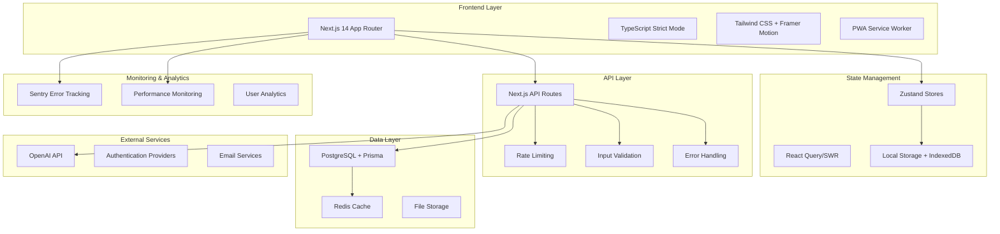

# Portfolio Readiness Audit - Design Document

## Overview

This design document outlines the comprehensive approach to elevate the AI Application Tracker to portfolio-ready standards. The project already demonstrates exceptional technical sophistication with advanced AI integration, comprehensive testing, PWA capabilities, and modern architecture. Our design focuses on final polish, optimization, and professional presentation.

## Architecture

### Current Architecture Assessment

**Strengths Identified:**
- Modern Next.js 14 App Router architecture
- Comprehensive TypeScript implementation
- Sophisticated state management with Zustand
- Advanced AI integration with OpenAI
- Extensive testing infrastructure (Jest, Playwright, accessibility testing)
- PWA capabilities with offline support
- Comprehensive error handling and monitoring
- Advanced features (automation, analytics, integrations)

**Areas for Enhancement:**
- TypeScript strict mode compliance
- Performance optimization opportunities
- Security hardening
- Documentation standardization
- Deployment pipeline optimization

### Target Architecture



## Components and Interfaces

### 1. Code Quality Enhancement System

**TypeScript Strict Mode Compliance**
```typescript
// Enhanced type definitions
interface StrictApplicationType {
  readonly id: string;
  readonly company: string;
  readonly position: string;
  readonly status: ApplicationStatus;
  readonly metadata: ApplicationMetadata;
  readonly timestamps: ApplicationTimestamps;
}

// Strict utility types
type RequiredFields<T, K extends keyof T> = T & Required<Pick<T, K>>;
type OptionalFields<T, K extends keyof T> = Omit<T, K> & Partial<Pick<T, K>>;
```

**Centralized Error Management**
```typescript
interface ErrorContext {
  component: string;
  action: string;
  userId?: string;
  metadata?: Record<string, unknown>;
}

interface ErrorHandler {
  handleError(error: Error, context: ErrorContext): void;
  reportError(error: Error, context: ErrorContext): Promise<void>;
  recoverFromError(error: Error, context: ErrorContext): unknown;
}
```

### 2. Performance Optimization System

**Bundle Optimization Strategy**
```typescript
// Dynamic imports for code splitting
const LazyAnalyticsDashboard = lazy(() => import('./analytics/AdvancedAnalyticsDashboard'));
const LazyAIInsights = lazy(() => import('./ai/AIInsightsDashboard'));
const LazyAutomationPanel = lazy(() => import('./automation/WorkflowManager'));

// Route-based code splitting
const routes = {
  '/analytics': () => import('./pages/analytics'),
  '/automation': () => import('./pages/automation'),
  '/integrations': () => import('./pages/integrations'),
};
```

**Database Query Optimization**
```typescript
// Optimized Prisma queries with proper includes
const getApplicationsWithRelations = async (userId: string) => {
  return prisma.application.findMany({
    where: { userId },
    include: {
      reminders: {
        where: { isCompleted: false },
        orderBy: { dueDate: 'asc' }
      },
      automationTasks: {
        where: { status: 'pending' }
      }
    },
    orderBy: { createdAt: 'desc' }
  });
};
```

### 3. Security Enhancement System

**Advanced Rate Limiting**
```typescript
interface RateLimitConfig {
  windowMs: number;
  maxRequests: number;
  skipSuccessfulRequests?: boolean;
  skipFailedRequests?: boolean;
  keyGenerator?: (req: Request) => string;
}

interface SecurityMiddleware {
  rateLimit(config: RateLimitConfig): Middleware;
  validateInput(schema: ZodSchema): Middleware;
  sanitizeOutput(data: unknown): unknown;
  checkPermissions(resource: string, action: string): Middleware;
}
```

**Input Validation & Sanitization**
```typescript
// Comprehensive Zod schemas
const ApplicationCreateSchema = z.object({
  company: z.string().min(1).max(100).trim(),
  position: z.string().min(1).max(200).trim(),
  location: z.string().max(100).trim().optional(),
  jobDescription: z.string().max(10000).optional(),
  requirements: z.array(z.string().max(500)).max(20).optional(),
  tags: z.array(z.string().max(50)).max(10).optional(),
}).strict();
```

### 4. Testing & Quality Assurance System

**Comprehensive Test Architecture**
```typescript
// Test utilities and helpers
interface TestContext {
  user: MockUser;
  applications: MockApplication[];
  mockServices: MockServices;
}

interface TestSuite {
  unit: UnitTestRunner;
  integration: IntegrationTestRunner;
  e2e: E2ETestRunner;
  accessibility: AccessibilityTestRunner;
  performance: PerformanceTestRunner;
}
```

**Accessibility Testing Framework**
```typescript
// Automated accessibility testing
const accessibilityTests = {
  colorContrast: () => checkColorContrast(),
  keyboardNavigation: () => testKeyboardNavigation(),
  screenReaderCompatibility: () => testScreenReader(),
  focusManagement: () => testFocusManagement(),
  ariaLabels: () => validateAriaLabels(),
};
```

### 5. Monitoring & Observability System

**Error Tracking & Performance Monitoring**
```typescript
interface MonitoringConfig {
  errorTracking: {
    dsn: string;
    environment: string;
    sampleRate: number;
  };
  performance: {
    enableWebVitals: boolean;
    enableUserTiming: boolean;
    enableResourceTiming: boolean;
  };
  analytics: {
    trackUserActions: boolean;
    trackPerformanceMetrics: boolean;
    trackErrorRates: boolean;
  };
}
```

## Data Models

### Enhanced Application Model
```typescript
interface Application {
  // Core fields
  readonly id: string;
  readonly userId: string;
  company: string;
  position: string;
  location?: string;
  status: ApplicationStatus;
  
  // Enhanced metadata
  metadata: {
    source: ApplicationSource;
    priority: Priority;
    tags: readonly string[];
    customFields: Record<string, unknown>;
  };
  
  // Timestamps
  timestamps: {
    readonly createdAt: Date;
    readonly updatedAt: Date;
    appliedDate: Date;
    responseDate?: Date;
    interviewDate?: Date;
    offerDate?: Date;
    rejectionDate?: Date;
  };
  
  // AI insights
  aiInsights?: {
    matchScore: number;
    confidence: number;
    recommendations: readonly string[];
    lastAnalyzed: Date;
  };
  
  // Relations
  reminders: readonly Reminder[];
  activities: readonly Activity[];
  automationTasks: readonly AutomationTask[];
}
```

### Performance Metrics Model
```typescript
interface PerformanceMetrics {
  webVitals: {
    fcp: number; // First Contentful Paint
    lcp: number; // Largest Contentful Paint
    fid: number; // First Input Delay
    cls: number; // Cumulative Layout Shift
    ttfb: number; // Time to First Byte
  };
  
  customMetrics: {
    applicationLoadTime: number;
    searchResponseTime: number;
    aiAnalysisTime: number;
    exportGenerationTime: number;
  };
  
  resourceMetrics: {
    bundleSize: number;
    imageOptimization: number;
    cacheHitRate: number;
    apiResponseTimes: Record<string, number>;
  };
}
```

## Error Handling

### Centralized Error Management Strategy

**Error Classification System**
```typescript
enum ErrorSeverity {
  LOW = 'low',
  MEDIUM = 'medium',
  HIGH = 'high',
  CRITICAL = 'critical'
}

enum ErrorCategory {
  VALIDATION = 'validation',
  AUTHENTICATION = 'authentication',
  AUTHORIZATION = 'authorization',
  NETWORK = 'network',
  DATABASE = 'database',
  AI_SERVICE = 'ai_service',
  PERFORMANCE = 'performance',
  UNKNOWN = 'unknown'
}

interface ApplicationError extends Error {
  readonly id: string;
  readonly severity: ErrorSeverity;
  readonly category: ErrorCategory;
  readonly context: ErrorContext;
  readonly timestamp: Date;
  readonly userId?: string;
  readonly recoverable: boolean;
}
```

**Error Recovery Strategies**
```typescript
interface ErrorRecoveryStrategy {
  canRecover(error: ApplicationError): boolean;
  recover(error: ApplicationError): Promise<unknown>;
  fallback(error: ApplicationError): unknown;
}

const errorRecoveryStrategies: Record<ErrorCategory, ErrorRecoveryStrategy> = {
  [ErrorCategory.NETWORK]: new NetworkErrorRecovery(),
  [ErrorCategory.AI_SERVICE]: new AIServiceErrorRecovery(),
  [ErrorCategory.DATABASE]: new DatabaseErrorRecovery(),
  // ... other strategies
};
```

### Error Boundaries & Fallbacks

**Component-Level Error Boundaries**
```typescript
interface ErrorBoundaryProps {
  fallback: ComponentType<ErrorFallbackProps>;
  onError?: (error: Error, errorInfo: ErrorInfo) => void;
  isolate?: boolean;
  children: ReactNode;
}

const ErrorBoundary: FC<ErrorBoundaryProps> = ({
  fallback: Fallback,
  onError,
  isolate = false,
  children
}) => {
  // Implementation with sophisticated error handling
};
```

## Testing Strategy

### Multi-Layer Testing Approach

**1. Unit Testing (90%+ Coverage Target)**
```typescript
// Business logic testing
describe('ApplicationService', () => {
  describe('calculateSuccessRate', () => {
    it('should calculate correct success rate for various scenarios', () => {
      // Comprehensive test cases
    });
  });
  
  describe('analyzeApplicationPatterns', () => {
    it('should identify meaningful patterns in application data', () => {
      // Pattern analysis testing
    });
  });
});
```

**2. Integration Testing**
```typescript
// API endpoint testing
describe('Applications API', () => {
  describe('POST /api/applications', () => {
    it('should create application with proper validation', async () => {
      // Full request/response cycle testing
    });
  });
});
```

**3. End-to-End Testing**
```typescript
// User workflow testing
test('Complete application management workflow', async ({ page }) => {
  // Test entire user journey from login to application management
  await page.goto('/');
  await page.click('[data-testid="add-application"]');
  // ... complete workflow testing
});
```

**4. Accessibility Testing**
```typescript
// Automated accessibility testing
describe('Accessibility Compliance', () => {
  it('should meet WCAG 2.1 AA standards', async () => {
    const results = await axe(document);
    expect(results.violations).toHaveLength(0);
  });
});
```

**5. Performance Testing**
```typescript
// Performance benchmarking
describe('Performance Benchmarks', () => {
  it('should load dashboard within performance budget', async () => {
    const metrics = await measurePerformance();
    expect(metrics.fcp).toBeLessThan(1500);
    expect(metrics.lcp).toBeLessThan(2500);
  });
});
```

### Testing Infrastructure

**Test Environment Setup**
```typescript
// Test configuration
const testConfig = {
  testEnvironment: 'jsdom',
  setupFilesAfterEnv: ['<rootDir>/jest.setup.js'],
  testPathIgnorePatterns: ['<rootDir>/.next/', '<rootDir>/node_modules/'],
  collectCoverageFrom: [
    'components/**/*.{js,jsx,ts,tsx}',
    'lib/**/*.{js,jsx,ts,tsx}',
    'app/**/*.{js,jsx,ts,tsx}',
    '!**/*.d.ts',
    '!**/node_modules/**',
  ],
  coverageThreshold: {
    global: {
      branches: 90,
      functions: 90,
      lines: 90,
      statements: 90,
    },
  },
};
```

## Security Implementation

### Authentication & Authorization

**Enhanced Security Measures**
```typescript
// Security configuration
const securityConfig = {
  authentication: {
    sessionTimeout: 24 * 60 * 60 * 1000, // 24 hours
    refreshTokenRotation: true,
    multiFactorAuth: false, // Future enhancement
  },
  
  authorization: {
    rbac: false, // Role-based access control (future)
    resourcePermissions: true,
  },
  
  dataProtection: {
    encryption: {
      algorithm: 'aes-256-gcm',
      keyRotation: true,
    },
    backup: {
      encrypted: true,
      retention: 90, // days
    },
  },
};
```

### Input Validation & Sanitization

**Comprehensive Validation Strategy**
```typescript
// Multi-layer validation
const validationLayers = {
  client: {
    realTimeValidation: true,
    formValidation: true,
    typeChecking: true,
  },
  
  server: {
    schemaValidation: true,
    sanitization: true,
    businessRuleValidation: true,
  },
  
  database: {
    constraintValidation: true,
    typeValidation: true,
  },
};
```

## Performance Optimization

### Bundle Optimization Strategy

**Code Splitting Implementation**
```typescript
// Route-based splitting
const routeComponents = {
  '/': lazy(() => import('./pages/Dashboard')),
  '/analytics': lazy(() => import('./pages/Analytics')),
  '/automation': lazy(() => import('./pages/Automation')),
  '/integrations': lazy(() => import('./pages/Integrations')),
};

// Feature-based splitting
const featureComponents = {
  AIInsights: lazy(() => import('./components/ai/AIInsightsDashboard')),
  AdvancedAnalytics: lazy(() => import('./components/analytics/AdvancedAnalyticsDashboard')),
  WorkflowManager: lazy(() => import('./components/automation/WorkflowManager')),
};
```

**Resource Optimization**
```typescript
// Image optimization
const imageOptimization = {
  formats: ['webp', 'avif', 'jpeg'],
  sizes: [640, 768, 1024, 1280, 1536],
  quality: 85,
  loading: 'lazy',
};

// Font optimization
const fontOptimization = {
  preload: ['Inter-Regular.woff2', 'Inter-Medium.woff2'],
  display: 'swap',
  subset: 'latin',
};
```

### Database Optimization

**Query Optimization Strategy**
```typescript
// Optimized queries with proper indexing
const optimizedQueries = {
  getApplications: {
    select: {
      id: true,
      company: true,
      position: true,
      status: true,
      appliedDate: true,
      // Only select needed fields
    },
    where: {
      userId: true,
      // Use indexed fields for filtering
    },
    orderBy: {
      appliedDate: 'desc',
      // Use indexed fields for sorting
    },
  },
};
```

## Deployment & DevOps

### CI/CD Pipeline Enhancement

**Automated Pipeline Configuration**
```yaml
# Enhanced GitHub Actions workflow
name: Portfolio Ready Deployment
on:
  push:
    branches: [main, develop]
  pull_request:
    branches: [main]

jobs:
  quality-checks:
    runs-on: ubuntu-latest
    steps:
      - name: Code Quality
        run: |
          npm run lint
          npm run type-check
          npm run test:coverage
          npm run test:accessibility
          npm run test:performance
      
      - name: Security Scan
        run: |
          npm audit --audit-level high
          npm run security-scan
      
      - name: Build Optimization
        run: |
          npm run build
          npm run analyze-bundle
```

### Monitoring & Observability

**Production Monitoring Setup**
```typescript
// Monitoring configuration
const monitoringConfig = {
  errorTracking: {
    provider: 'sentry',
    sampleRate: 1.0,
    environment: process.env.NODE_ENV,
  },
  
  performance: {
    webVitals: true,
    customMetrics: true,
    realUserMonitoring: true,
  },
  
  logging: {
    level: 'info',
    structured: true,
    retention: 30, // days
  },
  
  alerting: {
    errorRate: { threshold: 5, window: '5m' },
    responseTime: { threshold: 2000, window: '5m' },
    availability: { threshold: 99.9, window: '1h' },
  },
};
```

## Documentation Strategy

### Comprehensive Documentation Plan

**1. Technical Documentation**
- API documentation with OpenAPI/Swagger
- Component documentation with Storybook
- Architecture decision records (ADRs)
- Database schema documentation

**2. User Documentation**
- Getting started guide
- Feature documentation
- Troubleshooting guide
- FAQ section

**3. Developer Documentation**
- Contributing guidelines
- Code style guide
- Testing guidelines
- Deployment procedures

**4. Portfolio Presentation**
- Project showcase README
- Technical highlights
- Performance metrics
- Feature demonstrations

## Success Metrics

### Portfolio Readiness KPIs

**Technical Excellence Metrics**
- Lighthouse Performance Score: 95+
- TypeScript Strict Mode: 100% compliance
- Test Coverage: 90%+ for business logic
- Security Audit: Zero high/critical issues
- Accessibility: WCAG 2.1 AA compliance

**Performance Metrics**
- First Contentful Paint: <1.5s
- Largest Contentful Paint: <2.5s
- Cumulative Layout Shift: <0.1
- Time to Interactive: <3.5s
- Bundle Size: Optimized with code splitting

**Quality Metrics**
- ESLint Errors: 0
- TypeScript Errors: 0
- Cyclomatic Complexity: <10 per function
- Technical Debt Ratio: <5%
- Documentation Coverage: 100% for public APIs

This design provides a comprehensive roadmap for transforming an already impressive project into a portfolio showcase that demonstrates world-class engineering capabilities and attention to detail.